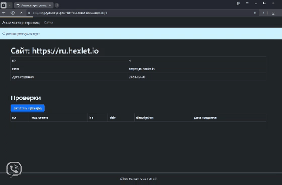

### Hexlet tests and linter status:
[](https://github.com/qffo/python-project-83/actions)
[](https://github.com/qffo/python-project-83/actions)
[](https://codeclimate.com/github/qffo/python-project-83/maintainability)


## Описание

Page Analyzer – это сайт, который анализирует указанные страницы на SEO-пригодность.

Задеплоенное приложение -> https://python-project-83-7rqr.onrender.com



## Минимальные требования для запуска проекта:
- Python version 3.10.15
- Pip version 24.2
- Poetry version 1.8.3

Этот проект был создан с использованием этих инструментов:

| Инструмент                                                    | Описание                                                  |
|---------------------------------------------------------------|-----------------------------------------------------------|
| [poetry](https://python-poetry.org/)                          | "Управление зависимостями Python"                      |
| [flask](https://flask.palletsprojects.com/en/3.0.x/)          | "Легковесный фреймворк для создания веб-приложений"       |
| [gunicorn](https://gunicorn.org/)                             | "HTTP-сервер Python WSGI для UNIX"                      |
| [beautifulsoup4](https://www.crummy.com/software/BeautifulSoup/bs4/doc.ru/bs4ru.html/) | "библиотека для парсинга HTML и XML документов" |
|  |  |
| [flake8](https://flake8.pycqa.org/)                           | "Линтер"                 |
---

#### Клонирование репозитария
```
git clone git@github.com:qffo/python-project-83.git
cd python-project-83
```  
#### Создание базы данных
```
whoami
{username}
sudo -u postgres createuser --createdb {username} 
createdb {databasename}
psql {databasename} < database.sql
```  
#### Секретные ключи
Создать в директории page_analyzer .env файл для переменных окружения со следующей информацией:  
DATABASE_URL=postgresql://{username}:{password}@{host}:{port}/{databasename}  
SECRET_KEY='{your secret key}'
#### Установка зависимостей
```make install```  
#### Разработка и локальное использование
```make dev```  
#### Команды для деплоя
```
make build    
make start
```  